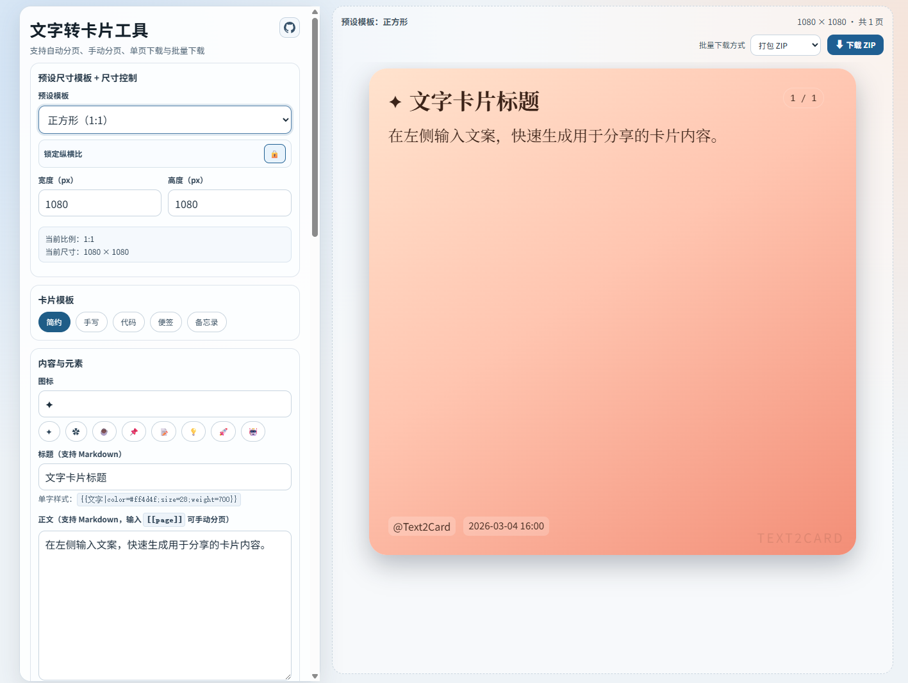
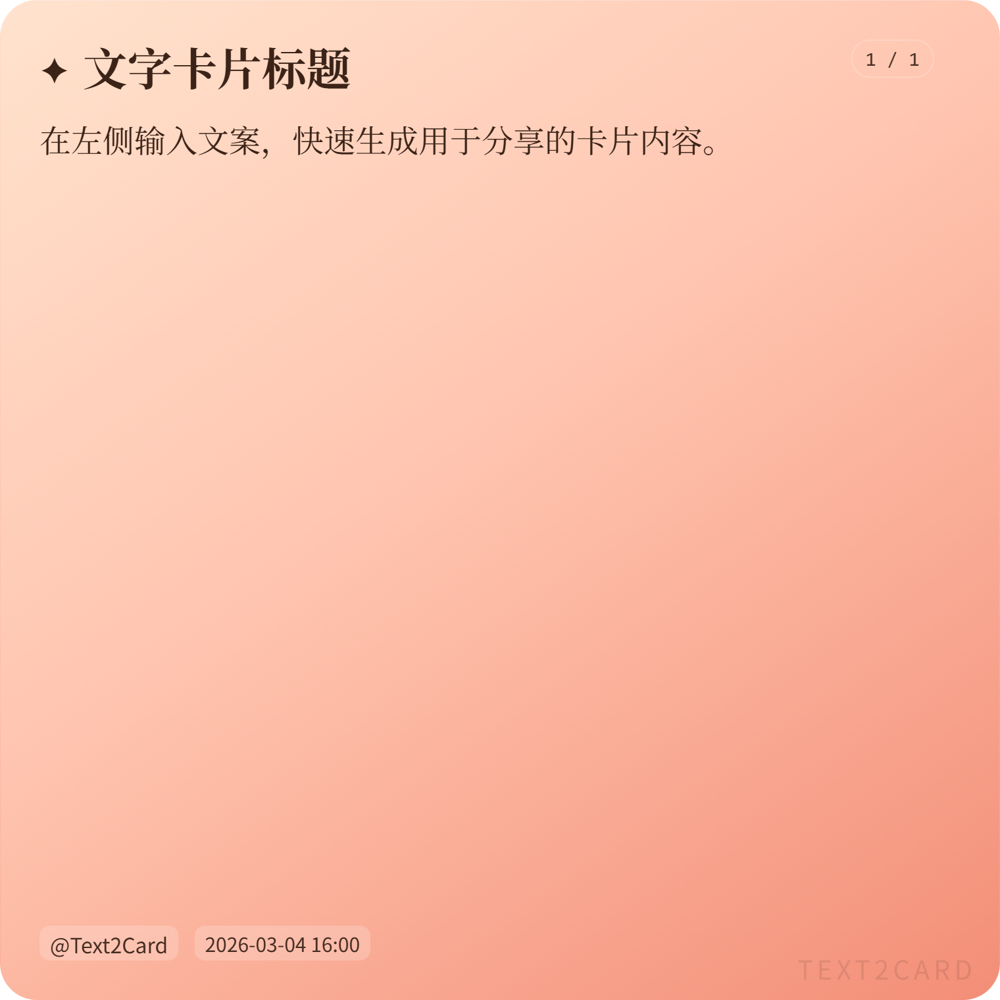
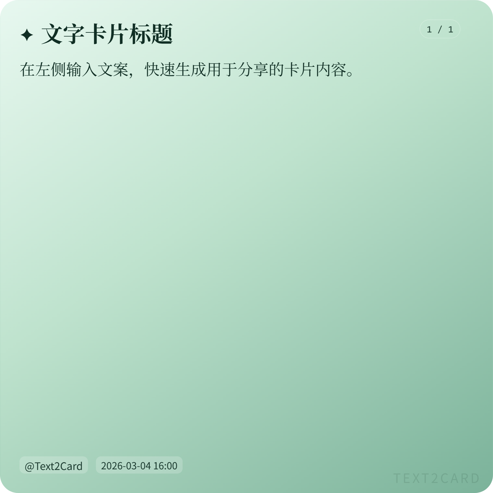
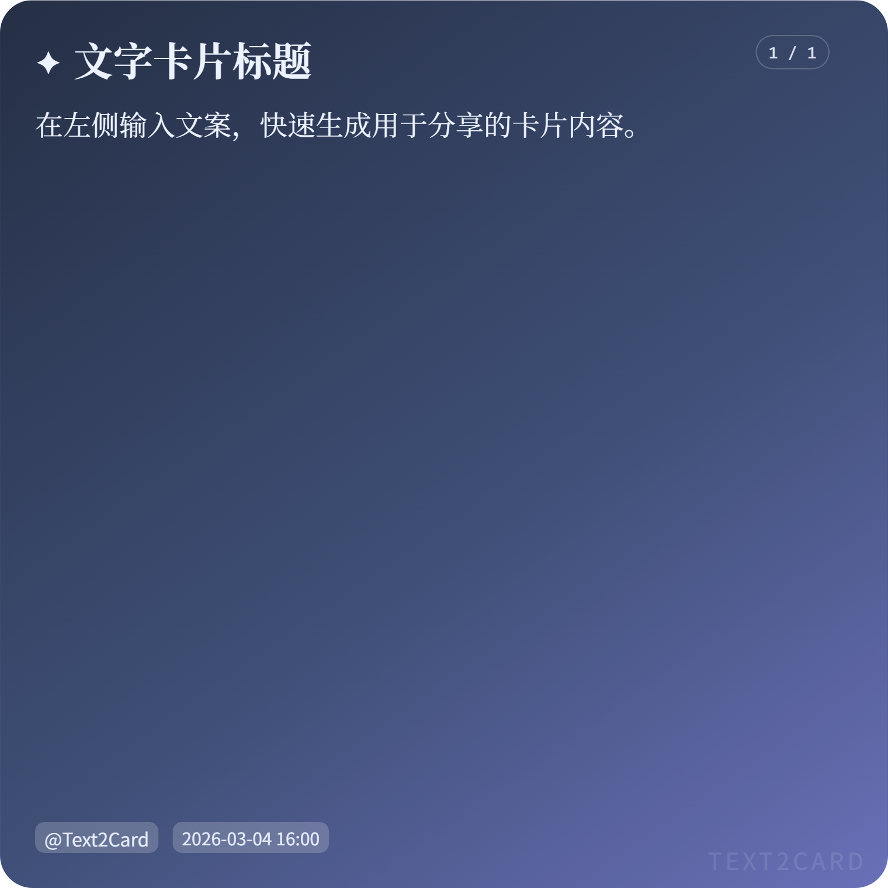
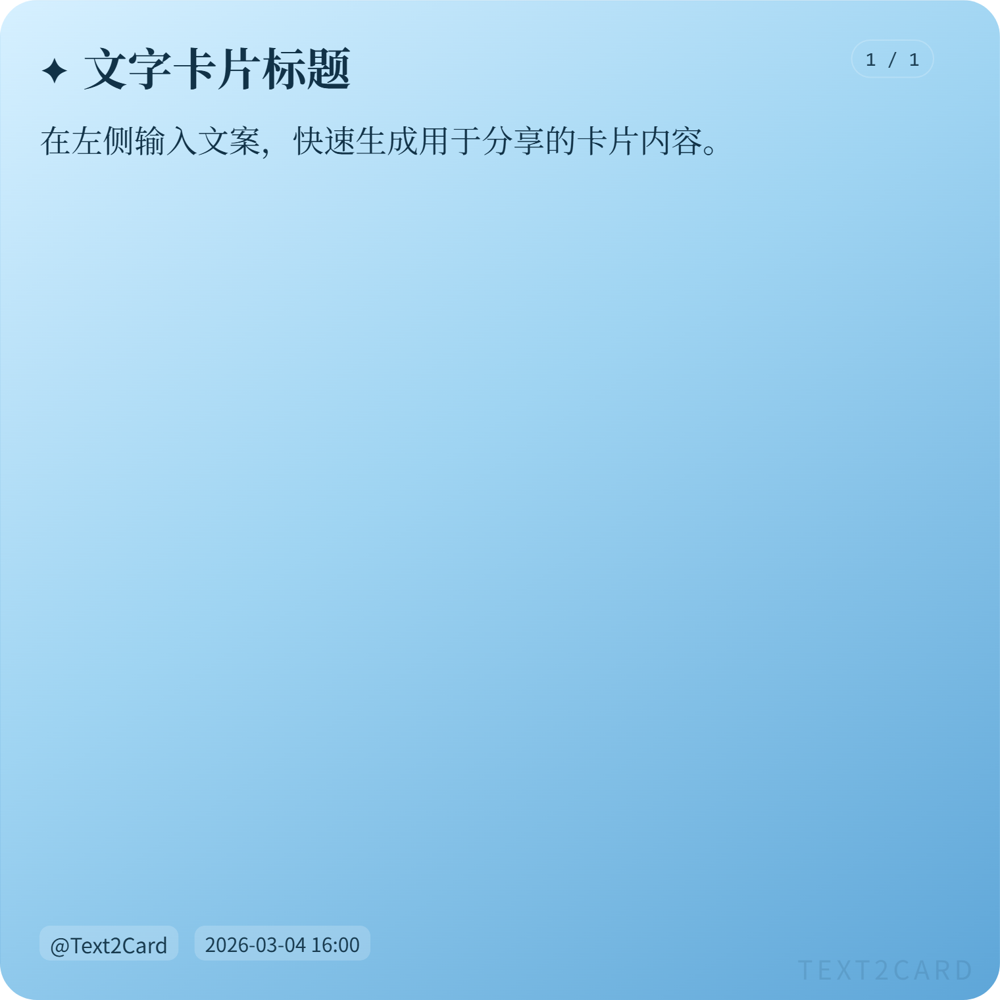
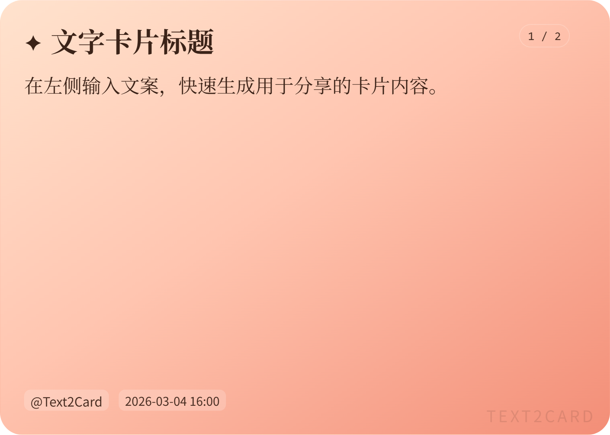
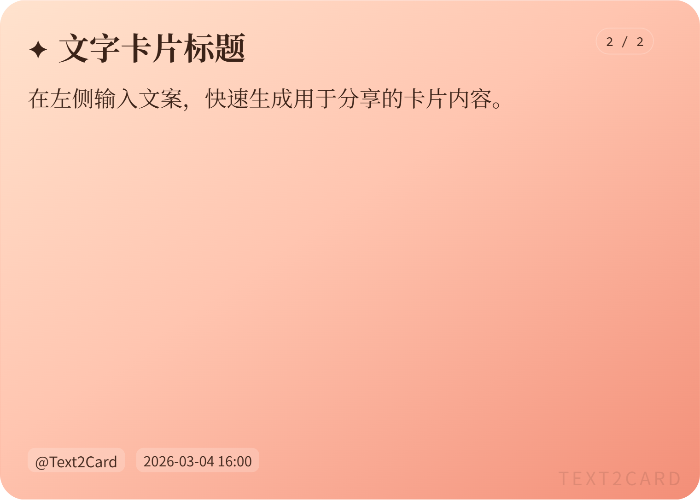

# Text2Card（Vue 3）

一个用于生成高质量图文卡片的前端工具，基于 `Vue 3 + Vite`。  
适合小红书、公众号封面、社媒配图、长文分页分享等场景。

## 主要能力

- 多尺寸模板与自定义尺寸
- 纵横比锁定（宽高联动）
- 多卡片模板：简约、手写、代码、便签、备忘录
- 主题系统：预设主题、纯色、渐变、背景图（含遮罩色与强度）
- 元素开关：图标、标题、署名、时间、页码、水印
- 字体独立控制：图标、标题、正文、署名、时间、页码、水印分别可设字体和字号
- 字体来源：内置本地字体 + 用户上传字体（`ttf/otf/woff/woff2`）
- 分页：正文自动分页 + 手动分页符
- 导出：单页下载、批量下载、ZIP 打包
- 标题/正文 Markdown 渲染
- 单字样式语法：可对局部文字设置颜色、字号、字重等

## 展示区

### 1. 编辑器与实时预览



### 2. 预设模板
**正方形 1：1**

**小红书 3：4**

**Pintersti 7：5**

**Youtube 16：9**


### 3. 主题
**晨光**

**山林**

**墨夜**

**海盐**


### 4. 分页展示
**p1**

**p2**


## 技术栈

- `Vue 3`
- `Vite`
- `html2canvas`
- `jszip`
- `marked`

## 本地开发

安装依赖：

```bash
npm install
```

启动开发环境：

```bash
npm run dev
```

生产构建：

```bash
npm run build
npm run preview
```

## 使用说明

### 1. 基础流程

1. 在左侧设置尺寸、模板、主题与字体。
2. 输入标题与正文内容。
3. 在右侧查看多页预览（同屏上下排列）。
4. 点击单页下载按钮或使用批量导出。

### 2. 尺寸模板

- 正方形 `1:1`
- 小红书 `3:4`
- 小红书长文 `3:5`
- Instagram `4:3`
- Pinterest `7:5`
- 抖音 `9:16`
- Youtube `16:9`
- A4 `210:297`
- 自定义

### 3. 分页规则

- 自动分页：根据当前卡片宽高、字体、行距自动计算。
- 手动分页：正文中插入 `[[page]]`。

```text
第一段内容
[[page]]
第二页内容
```

### 4. Markdown（标题与正文）

常见语法：

```md
# 一级标题
**加粗**、*斜体*、`行内代码`
- 列表
> 引用
[链接](https://example.com)
```

### 5. 单字样式语法

格式：

```text
{{文字|color=#ff4d4f;size=28;weight=700}}
```

支持键：

- `color` / `c`：文字颜色（支持 `hex/rgb/hsl/英文色`）
- `bg` / `background`：背景色
- `size` / `font-size` / `fs`：字号（如 `28`、`28px`、`1.2em`）
- `weight` / `w`：字重（`normal`、`bold`、`100~900`）
- `italic` / `i`：斜体（`true/false`）
- `underline` / `u`：下划线（`true/false`）

示例：

```text
今天的重点是 {{效率|color=#1677ff;weight=700}} 与 {{执行|bg=rgba(255,225,0,.35);size=30}}
```

### 6. 字体资源目录

当前内置字体目录：

```text
public/fonts/built-in/
```

字体 `@font-face` 配置文件：

```text
src/fonts.css
```

如果你手动调整了字体目录层级，请同步修改 `src/fonts.css` 中的 `url('/fonts/...')` 路径。

### 7. 导出

- 单页下载：卡片右上角悬浮下载按钮
- 批量下载：
- `ZIP`：所有页面打包为一个压缩包
- `逐张下载`：按页分别下载 PNG

## 项目结构

```text
src/
  App.vue        # 主界面与核心逻辑
  style.css      # 页面样式
  fonts.css      # 字体 @font-face 定义
public/
  fonts/
    built-in/    # 内置字体资源
```

## 常见问题（FAQ）

### 1. 构建时出现“字体将在运行时解析”的提示怎么办？

这是 Vite 对 `public/fonts/...` 资源的提示，不影响运行时加载。

### 2. 为何导出的图片字体不对？

请确认：

- 字体文件真实存在于 `public/fonts/built-in`。
- `src/fonts.css` 的 URL 与目录一致。
- 浏览器已成功加载字体（首次加载可能稍慢）。

### 3. 上传字体后没有显示在列表里？

请检查字体格式是否为 `ttf/otf/woff/woff2`，并确认浏览器支持 `FontFace API`。

### 4. 为什么分页结果会变化？

分页会受尺寸、字体、字号、行距、模板样式、显示元素开关影响，以上参数变化都会触发重新分页。

## Roadmap

- 字体自动同步脚本（本地目录新增字体后的自适应）
- 更多模板与主题包
- 可视化文本选区样式编辑器（替代手写语法）
- 导出 JPG/WebP 与高清倍率选项

## License

本项目使用 [MIT License](./LICENSE)。

## 免责声明

使用本项目即表示你同意并接受 [免责声明](./DISCLAIMER.md) 的全部内容。

### 字体侵权免责声明（后续处理）

- 项目默认仅提供可免费商用字体白名单；你自行新增、替换、上传的字体，其授权合规责任由你自行承担。
- 如后续收到字体侵权投诉，应立即停止使用并下架相关字体资源（含导出产物、静态资源与缓存）。
- 请及时完成字体替换与授权核验，并保留授权凭证、来源记录与处理时间线。
- 因未获授权字体使用、再分发或商用导致的任何争议与损失，项目作者与贡献者不承担责任。
