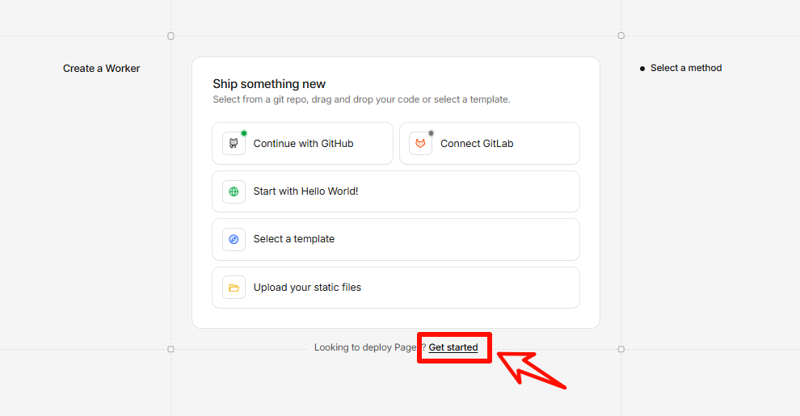
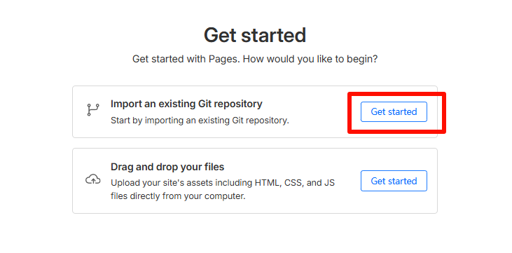
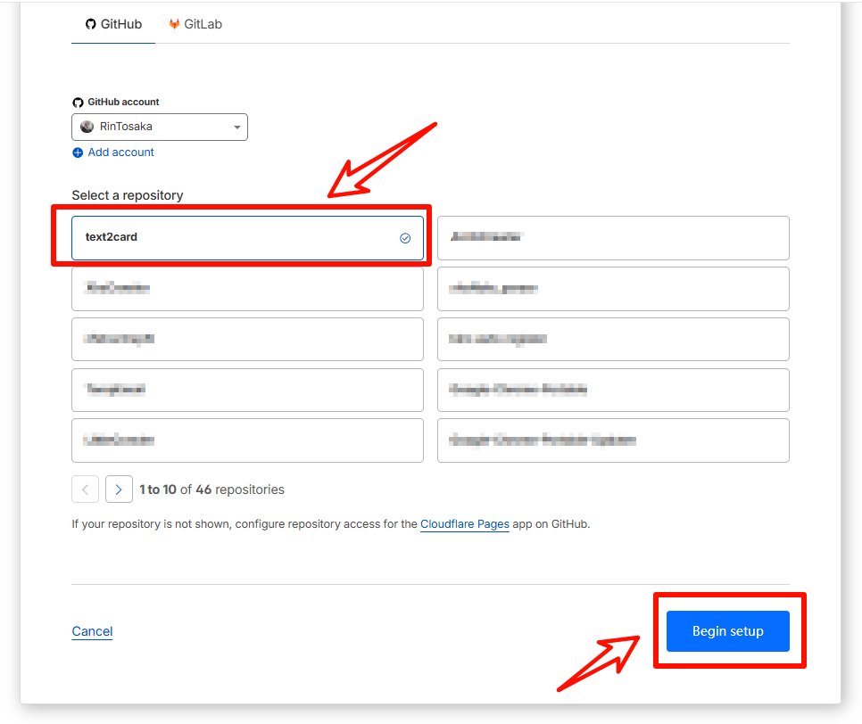
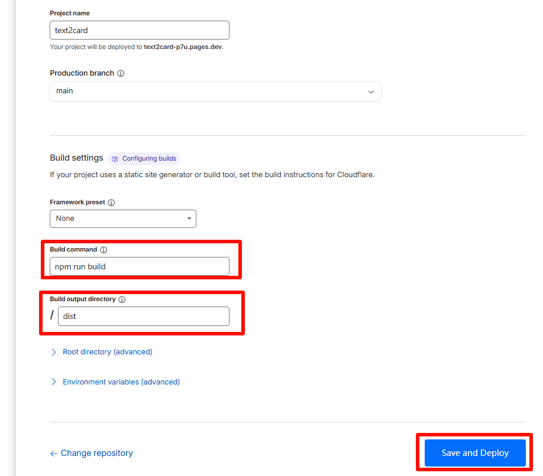

# Text2Card（Vue 3）

一个用于生成图文卡片的前端工具，基于 `Vue 3 + Vite`。支持多尺寸、主题、模板、分页与导出，适合社媒配图、长文分页分享等场景。

## 功能概览

- 尺寸模板 + 自定义尺寸（支持锁定纵横比）
- 卡片模板：简约、摘抄（配置文件驱动）
- 主题系统：预设主题、纯色、渐变、背景图（含遮罩色与强度）
- 元素开关：图标、标题、署名、时间、页码、水印
- 字体独立控制：图标、标题、正文、署名、时间、页码、水印分别可设字体和字号
- 字体来源：内置字体 + 用户上传字体（`ttf/otf/woff/woff2`）
- 分页：正文自动分页 + 手动分页符（`[[page]]`）
- 文本格式：Markdown + 单字样式语法
- 导出：单页下载、批量下载、ZIP 打包（含封面与当前配置）
- 用户模板：保存 / 更新 / 加载 / 删除（本地存储）

## 案例展示

- [小红书案例展示](https://www.xiaohongshu.com/explore/69b0340900000000220396f5?xsec_token=YBUs7Xgo9FStHrpxhskKkS2geB1Soe0tr1UadsU7lTMWE)

## 本地开发

安装依赖：

```bash
npm install
```

启动开发环境：

```bash
npm run dev
```

生产构建与预览：

```bash
npm run build
npm run preview
```

## Cloudflare Pages 部署

### 📂 第一步：Fork 项目

1. 访问 [text2card 项目](https://github.com/RinTosaka/text2card)
2. 点击右上角的 "Fork" 按钮
3. 选择您的 GitHub 账户
4. 确认 Fork 完成

### 🏗️ 第二步：创建 Pages 项目

访问 Cloudflare Dashboard

1. 登录 [Cloudflare Dashboard](https://dash.cloudflare.com/)

2. 选择左侧菜单的 "计算和AI" -> "Workers & Pages"

3. 点击 "创建应用程序"

4. 在最下方 `Looking to deploy Pages? `选择 "Get started"

   

5. 在 "导入现有 Git 存储库" 处点击 "开始使用"

   

6. 连接 GitHub 仓库

   1. 如果首次使用，需要授权 Cloudflare 访问 GitHub

   2. 选择您 Fork 的 `text2card` 仓库

   3. 点击 "开始设置"

      

7. 配置项目设置

   | 配置项       | 值                      | 说明         |
   | :----------- | :---------------------- | :----------- |
   | 项目名称     | `text2card`（或自定义） | 项目标识符   |
   | 生产分支     | `main`                  | 生产环境分支 |
   | 构建命令     | `npm run build`         |              |
   | 构建输出目录 | `dist`                  |              |

   

8. 部署项目

   1. 点击 "保存并部署"
   2. 等待部署完成

## 使用说明

### 1. 基础流程

1. 选择尺寸、卡片模板与主题。
2. 输入标题与正文内容。
3. 右侧实时预览（多页自动分页）。
4. 选择下载方式并导出。

### 2. 尺寸模板

- 正方形 `1:1`
- 小红书 `3:4`
- 小红书长文 `3:5`
- Instagram `4:3`
- Pinterest `7:5`
- 抖音 `9:16`
- Youtube `16:9`
- A4 `210:297`
- 自定义

### 3. 分页规则

- 自动分页：根据尺寸、字体、字号、行距自动计算。
- 手动分页：正文中插入 `[[page]]`。

```text
第一页内容
[[page]]
第二页内容
```

### 4. 文本换行

- 直接回车会换行，连续回车可保留空行。
- 也支持 `\n` 或 `<br>` 表示换行。

### 5. Markdown（标题与正文）

常见语法：

```md
# 一级标题
**加粗**、*斜体*、`行内代码`
- 列表
> 引用
```

### 6. 单字样式语法

格式：

```text
{{文字|color=#ff4d4f;size=28;weight=700}}
```

支持键：

- `color` / `c`：文字颜色（支持 `hex/rgb/hsl/英文色`）
- `bg` / `background`：背景色
- `size` / `font-size` / `fs`：字号（如 `28`、`28px`、`1.2em`）
- `weight` / `w`：字重（`normal`、`bold`、`100~900`）
- `italic` / `i`：斜体（`true/false`）
- `underline` / `u`：下划线（`true/false`）

示例：

```text
今天的重点是 {{效率|color=#1677ff;weight=700}} 与 {{执行|bg=rgba(255,225,0,.35);size=30}}
```

### 7. 模板配置

卡片模板由配置文件驱动：

```text
public/template/Clean.json
public/template/Quote_Extraction.json
```

## 项目结构

```text
src/
  App.vue        # 主界面与核心逻辑
  style.css      # 页面样式
  fonts.css      # 字体 @font-face 定义
public/
  fonts/
    built-in/    # 内置字体资源
  template/      # 卡片模板配置
```

## 技术栈

- `Vue 3`
- `Vite`
- `html2canvas`
- `jszip`
- `marked`

## License

本项目使用 [MIT License](./LICENSE)。

## 免责声明

使用本项目即表示你同意并接受 [免责声明](./DISCLAIMER.md) 的全部内容。

### 字体侵权免责声明（后续处理）

- 项目默认仅提供可免费商用字体白名单，可自行新增、替换、上传字体，其授权合规责任由你自行承担。
- 如后续收到字体侵权投诉，应立即停止使用并下架相关字体资源（含导出产物、静态资源与缓存）。
- 请及时完成字体替换与授权核验，并保留授权凭证、来源记录与处理时间线。
- 因未获授权字体使用、再分发或商用导致的任何争议与损失，项目作者与贡献者不承担责任。
